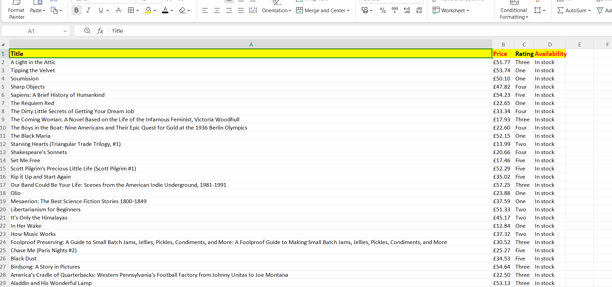

# Books Pagination Scraper 

A Python-based web scraper that extracts book details across all 50 pages from [Books to Scrape](https://books.toscrape.com/) using BeautifulSoup and Pandas.

##  Features
- **Multi-page Scraping (Pagination):** Automatically iterates through all 50 pages (1,000 products).
- **Data Extracted:**
  - Book Title
  - Price (£)
  - Rating
  - Stock Availability
- **Export to Excel:** Automatically formats and saves the collected data into an `.xlsx` file.

##  Project Screenshot


##  Tech Stack
- **Python**
- **Requests** (HTTP requests)
- **BeautifulSoup4** (HTML parsing)
- **Pandas** (Data handling & Excel export)
- **OpenPyXL** (Excel file support)

##  How to Run
1. Clone this repository:
   ```bash
   git clone [https://github.com/samadch2/books-pagination-scraper.git](https://github.com/samadch2/books-pagination-scraper.git)
