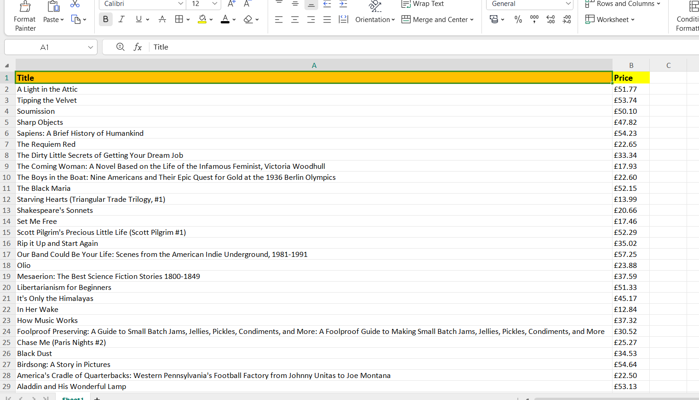

# Books Pagination Scraper

A Python web scraping script using BeautifulSoup and Requests to extract book details across multiple pages and save the data into an Excel spreadsheet.

## Features
- Handles multi-page pagination automatically
- Cleans price text and handles UTF-8 encoding
- Exports scraped data directly to Excel using Pandas

## Scraped Data Preview

